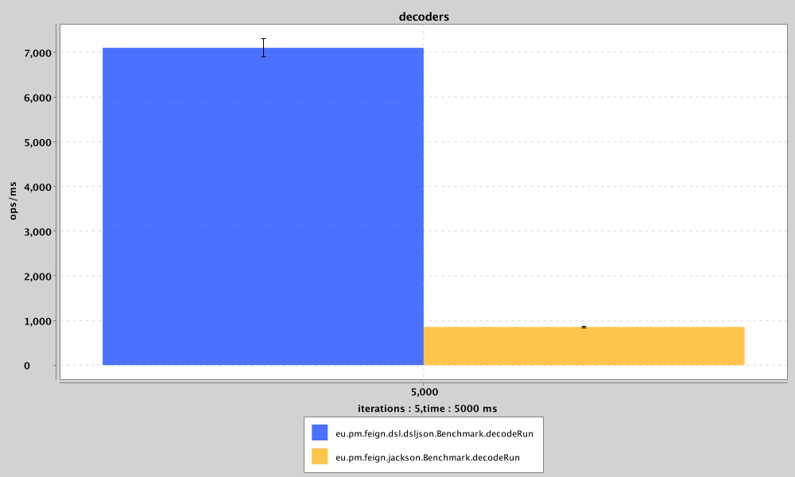

**todo** 
- randomize input

### *Decoder

```
sys : Darwin 22.5.0 Darwin Kernel Version 22.5.0: Mon Apr 24 20:51:50 PDT 2023; root:xnu-8796.121.2~5/RELEASE_X86_64 x86_64

# JMH version: 1.35
# VM version: JDK 17.0.7, Java HotSpot(TM) 64-Bit Server VM, 17.0.7+8-LTS-224
```
jmh Mode - Throughput,  



details :

```

Result "eu.pm.feign.dsl.dsljson.Benchmark.decodeRun":
  7100.766 ±(99.9%) 201.174 ops/ms [Average]
  (min, avg, max) = (7013.286, 7100.766, 7146.430), stdev = 52.244
  CI (99.9%): [6899.592, 7301.941] (assumes normal distribution)

```

```

Result "eu.pm.feign.jackson.Benchmark.decodeRun":
  853.842 ±(99.9%) 13.652 ops/ms [Average]
  (min, avg, max) = (849.910, 853.842, 858.226), stdev = 3.545
  CI (99.9%): [840.190, 867.493] (assumes normal distribution)

```